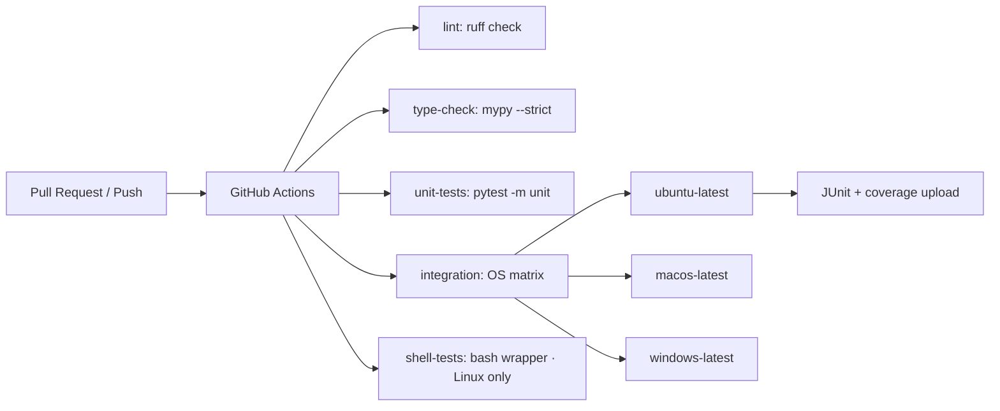
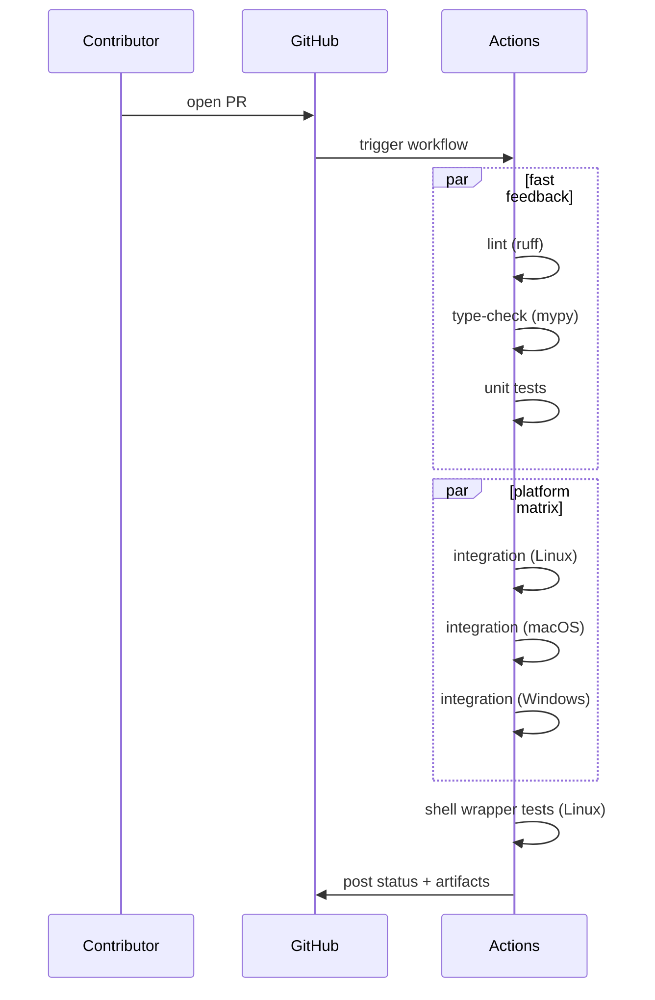

# Continuous Integration — Technical Specification

Last updated: 2026-03-10
Status: **Draft**

This document defines the CI pipeline for the `cli-tools` repository. It maps CI behaviour to the policies in `.copilot` (`.ai-rules.md`, `install.spec.md`, `teleport.spec.md`) and describes the GitHub Actions workflow, job layout, and validation checks required to keep the project correct and safe.

---

## 1. Overview

CI validates the repository against the project's technical standards: Python ≥3.12 runtime, strict typing via `mypy`, linting via `ruff`, unit and integration test suites, cross-platform behaviour (Linux/macOS/Windows), and safety constraints (file permissions, atomic writes). CI is the single guardrail preventing regressions and ensuring releases meet non-functional requirements.

Goals

- Enforce Python runtime and dependency correctness via `uv`.
- Run `mypy --strict` and `ruff check` to satisfy `.ai-rules.md`.
- Run unit and integration tests on every PR and push.
- Run cross-platform integration tests (Linux, macOS, Windows) and shell wrapper tests.
- Validate manifest and DB file permissions on POSIX (0o600/0o700).
- Provide fast PR feedback with deeper full-matrix checks on merges.
- Produce reproducible artifacts (JUnit XML, coverage reports).

Non-goals

- CI will not change application code. It only validates and reports.
- CI will not manage releases or publish packages (covered by a future packaging spec).

---

## 2. Requirements

### 2.1 Functional CI requirements

- CI runs on GitHub Actions, triggered on pull requests and pushes to `main`.
- CI must run the following checks:
  - **Dependency validation**: `uv sync --group dev` succeeds without suppressing errors.
  - **Type checking**: `mypy --strict` using the `[tool.mypy]` configuration in `pyproject.toml`.
  - **Linting**: `ruff check src tests` using the `[tool.ruff]` configuration in `pyproject.toml`.
  - **Unit tests**: `pytest -m unit tests/unit/` — fail on any test failure.
  - **Integration tests**: `pytest -m integration tests/integration/` — run with isolated `CLI_TOOLS_DATA_DIR` (handled by test fixtures).
  - **Shell wrapper tests**: `bash tests/shell/test_bash_wrapper.sh` — run on Linux only.
  - **Cross-platform integration**: run integration tests on `ubuntu-latest`, `macos-latest`, and `windows-latest`.
  - **Permission checks**: existing integration tests validate POSIX permissions (0o600/0o700) for manifests and DB directories; these run as part of the standard suite on Linux/macOS.

### 2.2 Non-functional CI requirements

- **Fail fast**: never suppress install errors (`|| true`). Every step must fail CI on error.
- **Reproducible environments**: install from `pyproject.toml` via `uv sync`.
- **Speed**: run lint + type-check + unit tests as fast-feedback jobs; run full OS matrix in parallel.
- **Cache**: cache the uv environment to reduce job setup time.
- **Secrets**: never print secrets; use GitHub Actions secret store if external tokens are needed.
- **Artifacts**: upload JUnit XML and coverage reports for debugging.

---

## 3. CI Architecture

GitHub Actions with parallel jobs sharing a common setup pattern. Each job checks out the repo, sets up Python + uv, and installs dependencies.



PR run sequence:



---

## 4. Job definitions

### 4.1 Common setup (repeated per job)

1. `actions/checkout@v4`
2. `astral-sh/setup-uv@v4` — installs uv
3. `actions/setup-python@v5` with `python-version: "3.12"`
4. `uv sync --group dev` — installs the project and all dev dependencies into `.venv`
5. Cache `.venv` keyed by `uv.lock` hash and OS

### 4.2 Lint job

- `uv run ruff check src tests`
- Fail on any violation.

### 4.3 Type-check job

- `uv run mypy --strict src`
- Uses `[tool.mypy]` from `pyproject.toml` (strict = true, python_version = "3.12").
- Fail on any diagnostic.

### 4.4 Unit tests job

- `uv run pytest -m unit tests/unit/ --junitxml=reports/unit.xml --cov=src --cov-report=xml:reports/coverage.xml`
- Upload JUnit XML and coverage as artifacts.
- Runs on `ubuntu-latest` only (unit tests are platform-independent).

### 4.5 Integration tests jobs (OS matrix)

- Matrix: `[ubuntu-latest, macos-latest, windows-latest]`
- `uv run pytest -m integration tests/integration/ --junitxml=reports/integration.xml`
- Tests already isolate themselves via `tmp_path` and `CLI_TOOLS_DATA_DIR` fixtures — no extra environment setup needed at the job level.
- Permission/atomicity tests (0o600 manifests, atomic renames) run as part of this suite on POSIX runners.
- Upload JUnit XML as artifacts.

### 4.6 Shell wrapper tests job

- Runs on `ubuntu-latest` only.
- `bash tests/shell/test_bash_wrapper.sh`
- This is a standalone bash script, not a pytest test. Fail CI if the script exits non-zero.

### 4.7 Artifact collection

- JUnit XML reports from unit and integration jobs.
- Coverage XML from the unit test job.
- Uploaded via `actions/upload-artifact@v4`.

### 4.8 Failure behaviour

- Every failing job blocks PR merge (branch protection required check).
- No automatic retry — flaky tests must be fixed, not masked.

---

## 5. Mapping CI checks to .copilot requirements

| .copilot requirement | CI enforcement |
|---|---|
| Python ≥3.12 | `setup-python` pin + `requires-python` in pyproject.toml |
| Type checking in strict mode (`.ai-rules.md`) | `mypy --strict` job |
| Linting / style rules (`.ai-rules.md`) | `ruff check` job |
| Test coverage (`.ai-rules.md` §5) | `pytest` unit + integration jobs |
| Cross-platform shells (`install.spec.md`) | OS matrix for integration tests |
| Atomic writes / permissions (`install.spec.md` NFR1/NFR3) | Existing integration tests on POSIX runners |
| Shell wrapper behaviour (`teleport.spec.md`) | `test_bash_wrapper.sh` on Linux |

---

## 6. Execution plan

### Phase 1 — Core workflow

- Replace the existing `ci.yml` with the new job layout.
- Jobs: lint, type-check, unit-tests, integration (Linux only initially), shell-tests.
- Use `astral-sh/setup-uv@v4` + `uv sync --group dev` for all jobs.
- Remove the `|| true` install hack and the fake uv shim from the existing workflow.
- Validate that all jobs pass on a PR.

### Phase 2 — Cross-platform matrix

- Expand integration tests to the `[ubuntu-latest, macos-latest, windows-latest]` matrix.
- Triage and fix any platform-specific test failures (e.g., path separators, permission semantics on Windows).

### Phase 3 — Artifacts and polish

- Add JUnit XML + coverage artifact uploads.
- Enable caching for uv (`.venv` keyed by `uv.lock`).
- Configure branch protection to require all CI jobs.

---

## 7. Security

- Use GitHub Actions secrets for any tokens; never echo secrets in logs.
- Do not store secrets in artifacts or caches.
- The workflow requires no external secrets for basic CI — only `actions/checkout` with the default `GITHUB_TOKEN`.

---

## 8. Existing workflow gap analysis

The current `.github/workflows/ci.yml` has these problems:

1. **`pip install -e . || true`** — suppresses build failures silently.
2. **Manual `pip install` of individual packages** — bypasses the declared dependency specification.
3. **Fake uv shim** — no longer needed since shell snippets embed the absolute `tp-cli` path at install time.
4. **No type-check or lint jobs** — `mypy` and `ruff` are not run.
5. **Single OS only** — only `ubuntu-latest`, no macOS/Windows coverage.
6. **No artifact uploads** — no JUnit XML or coverage reports.
7. **Runs `pytest -q` on the entire suite** — doesn't distinguish unit from integration tests.

All of these are addressed by the new workflow design in §4.

---

## 9. Appendix — intended job structure (reference)

```yaml
# Conceptual layout — not final YAML
name: CI
on:
  push: { branches: [main] }
  pull_request: { branches: [main] }

jobs:
  lint:
    runs-on: ubuntu-latest
    # setup-uv, setup-python, uv sync, ruff check

  type-check:
    runs-on: ubuntu-latest
    # setup-uv, setup-python, uv sync, mypy --strict

  unit-tests:
    runs-on: ubuntu-latest
    # setup-uv, setup-python, uv sync, pytest -m unit + coverage

  integration:
    strategy:
      matrix:
        os: [ubuntu-latest, macos-latest, windows-latest]
    runs-on: ${{ matrix.os }}
    # setup-uv, setup-python, uv sync, pytest -m integration

  shell-tests:
    runs-on: ubuntu-latest
    # setup-uv, setup-python, uv sync, bash tests/shell/test_bash_wrapper.sh
```

---

End of CI specification.