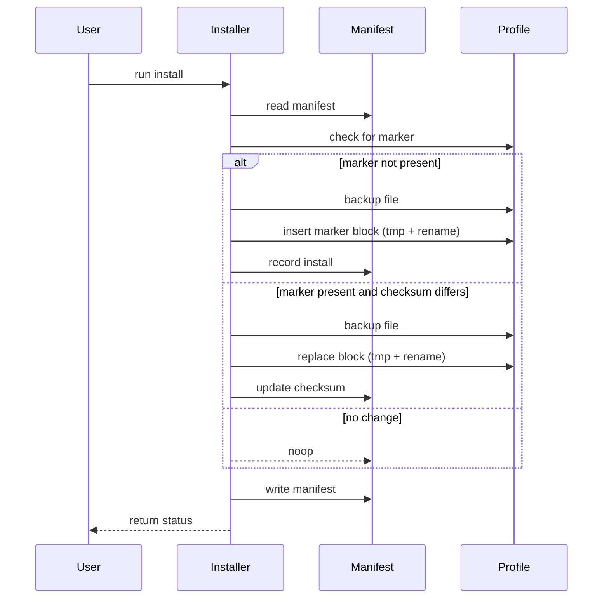

# Idempotent Shell Snippet Installer — Technical Specification

Last updated: 2026-03-10
Status: **Draft**

This document defines the design, requirements and implementation plan for an idempotent, updatable shell-snippet installer for the `tp` (teleport) shell wrapper. The installer must safely write shell snippet files and update user shell profiles (bash, zsh, fish, PowerShell, cmd) in an idempotent way so repeated runs do not duplicate configuration and future updates replace existing snippets when content changes.

---

## 1. Overview

The installer provides a reproducible mechanism to install shell wrapper snippets shipped in `src/cli_layer/shell_snippets/` and to integrate them into user shell startup files. The installer must be safe to run multiple times, detect and apply updates to snippet content, and provide uninstall/rollback functionality.

Goals:
- Idempotent install: running the installer any number of times leaves user files in a single consistent state.
- Updatable: when snippet files change in the repo, re-running the installer updates the profile blocks accordingly.
- Reversible: support uninstall that restores backed-up originals.
- Cross-platform: support Bash/Zsh/Fish on POSIX and PowerShell/Cmd on Windows.
- Auditable: maintain an install manifest in the per-user data directory (via `get_data_dir()`) recording installed snippets, checksums, and backups.

Non-goals:
- Global system-wide installs (this spec targets per-user installs only via shell/profile updates).

---

## 2. Requirements

Functional requirements

- FR1: Install snippet files from `src/cli_layer/shell_snippets/` into user shells via profile edits or a central wrapper file.
- FR2: Use a manifest stored at `$DATA_DIR/install_manifest.json` (where `get_data_dir()` is used to locate `$DATA_DIR`) to record installed marker IDs, snippet filenames, checksums (SHA256), and backup paths. Do not create a per-tool subfolder under the data directory; the manifest is shared across all tools.
- FR3: When the installer runs, if a marker block for a snippet already exists and the checksum matches the manifest, do nothing (idempotent).
- FR4: When the installer runs and snippet checksum differs from manifest, atomically replace the marker block with the updated snippet, update manifest with new checksum, and create a timestamped backup of the prior file state.
- FR5: On first install, add a single marker block per snippet per profile; do not append duplicates.
- FR6: Provide `--uninstall` to remove marker blocks and, if present, restore the most recent backup.
- FR7: Provide `--dry-run` to report planned actions without modifying files.
- FR8: Provide clear CLI exit codes (0 success, 1 usage/error, 2 unsupported shell, 3 permission failure, 4 install failure) and concise human output to stderr.
- FR9: Support per-tool disable flags (for example `--no-tp`) so the installer can skip installing specific tools. The manifest must record enabled/disabled state per tool.

Non-functional requirements

- NFR1: All file edits must be atomic: write to temporary file, then rename into place.
- NFR2: Backups must be created before any changes and recorded in the manifest with timestamps.
- NFR3: Manifest must be created with restrictive permissions (POSIX: 0o600) and owned by the user.
- NFR4: Installer must not require root privileges and must operate on per-user profile files only.
- NFR5: Use only portable shell utilities on POSIX; on Windows use PowerShell built-ins rather than POSIX tools.
- NFR6: Installer should be idempotent and race-condition resistant when invoked concurrently (use manifest file locking e.g. flock or atomic rename semantics).

---

## 3. Architecture

Components

- Installer script: `scripts/install-shell-snippet.sh` — CLI entry executing install/update/uninstall flows.
- Manifest helper module: `src/cli_layer/install/manifest.py` — small Python helper to read/write manifest and compute checksums (used by installer if Python is preferred for complex logic).
- Shell snippets: `src/cli_layer/shell_snippets/tp.bash`, `tp.fish`, `tp.ps1`, `tp.bat` — canonical snippet sources.
- Profiles: user files to edit (POSIX examples): `~/.bashrc`, `~/.bash_profile`, `~/.zshrc`, `~/.config/fish/config.fish`; Windows PowerShell: `Microsoft.PowerShell_profile.ps1` paths.

Data layout

- Manifest path: `$DATA_DIR/install_manifest.json` (where `$DATA_DIR` is returned by `get_data_dir()` defined in `[src/core_lib/common/platform.py]`). The manifest is shared by all tools; do not create per-tool subfolders in the data dir for the manifest.
- Backup directory: `$DATA_DIR/backups/<tool>/` with timestamped files, one backup per modified profile. Backups are organized by tool under the shared backups directory to keep data discoverable without splitting manifests across subfolders.

Marker block format

- Each inserted snippet in a profile MUST be wrapped with a marker header/footer containing a stable ID and version/hash, e.g.:

  # >>> teleport snippet: tp.bash (id: teleport#tp.bash)
  ... snippet content ...
  # <<< teleport snippet: tp.bash

- Marker comment syntax must match the shell language comment style (POSIX `#`, PowerShell `#`, Batch `REM`).

---

## 4. Runtime flow

1. Determine `$DATA_DIR` via `get_data_dir()` ([src/core_lib/common/platform.py](src/core_lib/common/platform.py)).
2. Load or create manifest JSON at `$DATA_DIR/install_manifest.json` with structure. The manifest is shared across tools and records each marker's enabled status:

```json
{
  "installed": {
    "teleport#tp.bash": {
      "source": "src/cli_layer/shell_snippets/tp.bash",
      "profiles": ["~/.bashrc"],
      "checksum": "sha256...",
      "backups": [{"profile": "~/.bashrc", "backup_path": "$DATA_DIR/backups/teleport/bashrc.20260310T120000.bak", "timestamp": "2026-03-10T12:00:00Z"}],
      "enabled": true,
      "installed_at": "2026-03-10T12:00:00Z"
    }
  }
}
```

3. For each target profile file:
   - Ensure file exists (create empty file if missing and safe).
   - Search for the marker header for the snippet ID.
   - If header not found: insert marker block (write to temp, backup original, atomic rename), record checksum and backup path in manifest.
   - If header found: compare current manifest checksum vs new snippet checksum. If equal, noop; if different, create backup, replace block atomically, update manifest.

4. Persist manifest atomically (write to temp + rename) and set restrictive permissions.

5. Return exit code and human-readable summary to stderr.

---

## 5. Diagrams

ASCII flow:

User runs installer → installer calculates checksums → read manifest → for each profile: (insert/noop/update) → write backups → update manifest

Mermaid component diagram:

```mermaid
graph LR
  A[User] --> B[scripts/install-shell-snippet.sh]
  B --> C[Manifest helper: src/cli_layer/install/manifest.py]
  B --> D[Profile files (~/.bashrc, etc.)]
  B --> E[src/cli_layer/shell_snippets/*]
  C --> F[$DATA_DIR/install_manifest.json]
  D --> G[$DATA_DIR/backups/tool/]
```

Sequence diagram (high level):



---

## 6. Manifest schema

Top-level object fields:
- `installed`: map of `marker_id` -> metadata
- `marker_id` metadata:
  - `source`: snippet relative path (e.g. `src/cli_layer/shell_snippets/tp.bash`)
  - `profiles`: list of profile paths modified
  - `checksum`: SHA256 of installed snippet
  - `backups`: list of `{profile, backup_path, timestamp}`
  - `enabled`: boolean indicating whether installer should manage this snippet (respect `--no-<tool>` flags)
  - `installed_at`: timestamp

The manifest must be JSON, human-readable, and written atomically.

---

## 7. Profile selection rules

POSIX:
- For `bash`: default to `~/.bashrc` (interactive non-login shells, most common for interactive use). Use `--profiles` to override with `~/.bash_profile` or both if the user's environment requires it. The manifest records per-profile installs, so running twice with different profile overrides will track both correctly.
- For `zsh`, prefer `~/.zshrc`.
- For `fish`, use `~/.config/fish/config.fish`.

Windows:
- PowerShell: edit `$PROFILE` (resolved per-user PowerShell profile path). Use PowerShell to perform edits (no sed/awk). Create `tp.ps1` snippet file in `src/cli_layer/shell_snippets` and load it from profile with `.` (dot-source).
- CMD: create `tp.bat` and optionally update `%USERPROFILE%\init.bat` or instruct user to add to PATH; cmd profile locations vary — document manual step if automatic edit is unsafe.

---

## 8. Backup and rollback

- Before modifying a profile, copy to `$DATA_DIR/backups/<tool>/<profile>.<timestamp>.bak`.
- On `--uninstall`, remove marker blocks and attempt to restore the latest backup for the modified profile (recorded in manifest). If no backup, remove only the marker block.
- Keep retention policy minimal (e.g., last 5 backups) to avoid unbounded storage.

---

## 9. Concurrency and locking

- Use an advisory lock when writing the manifest and modifying profiles. On POSIX use `flock` (or atomic rename as fallback). On Windows rely on atomic file replace APIs and check manifest timestamp to detect concurrent changes.

---

## 10. Testing & Validation

The full test specification — with individual test IDs, names, and expected behaviour — lives in `.copilot/install.tests.md`. This section summarises the strategy only.

- **Unit tests** (`tests/unit/install/`): manifest helper read/write, permissions, CRUD, checksum computation.
- **Integration tests** (`tests/integration/install/`): run installer against isolated temp home directories, verifying idempotency, update detection, backup/restore, uninstall, per-tool flags, and concurrency.
- **Manual test cases**: each supported shell on representative platforms (Linux bash/zsh/fish, macOS bash/zsh, Windows PowerShell).

Test categories and IDs:
- **MAN-01–MAN-15**: manifest helper unit tests
- **INS-01–INS-25**: installer CLI integration tests
- **IDM-01–IDM-10**: idempotency tests
- **FLG-01–FLG-10**: per-tool flag tests

---

## 11. CLI & UX

- Default action (no flags): install/update all enabled tools.
- Flags:
  - `--uninstall`: remove all managed marker blocks and restore backups.
  - `--dry-run`: report planned actions without modifying files.
  - `--shell <bash|zsh|fish|powershell|cmd>`: override shell auto-detection.
  - `--profiles <path>[,<path>...]`: override profile path auto-discovery.
  - `--no-<tool>` (e.g. `--no-tp`): skip a specific tool; records `enabled: false` in manifest.
  - `--<tool>` (e.g. `--tp`): explicitly re-enable a previously disabled tool.
- Output: concise human-readable summary to stderr; per-action lines show `[install]`, `[update]`, `[noop]`, or `[skip]`.

---

## 12. Security

- Manifest and backups must be created with user-only permissions (POSIX 0o600/0o700 as appropriate).
- Avoid executing snippet contents during install; only write text to profiles.

---

## 13. Implementation notes & file links

- Modify: `[scripts/install-shell-snippet.sh](scripts/install-shell-snippet.sh)` to implement flows.
- Add: `[src/cli_layer/install/manifest.py](src/cli_layer/install/manifest.py)` helper.
- Snippets live at: `[src/cli_layer/shell_snippets/tp.bash](src/cli_layer/shell_snippets/tp.bash)`, `[tp.fish](src/cli_layer/shell_snippets/tp.fish)`, `[tp.ps1](src/cli_layer/shell_snippets/tp.ps1)`, `[tp.bat](src/cli_layer/shell_snippets/tp.bat)`.
- Tests: `tests/integration/install/`.

---

End of specification.
