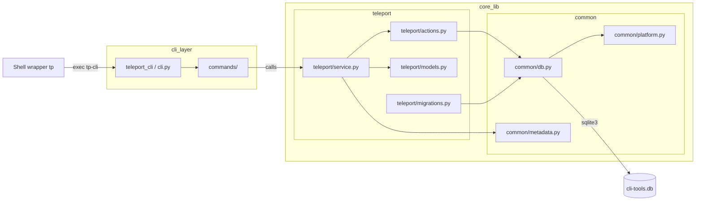

# Teleport — Technical Specification

Last updated: 2026-03-10  
Status: **Reviewed — shared DB architecture applied**

This document defines the design, requirements and implementation plan for the "teleport" tool (command: `tp`), implemented as a reusable core library (`core_lib`) and thin CLI adapter layer (`cli_layer`). The project root will be named `cli-tools`. The persistent state directory is pluggable via the environment variable `CLI_TOOLS_DATA_DIR`.

---

## 1. Overview

Teleport is a small, cross-platform CLI toolset for quickly pinning and jumping between filesystem paths (aliases). The implementation is layered to support multiple tools in the repository: the library layer (`core_lib`) contains all feature code, DB actions, logging and platform mappings; the adapter layer (`cli_layer`) contains the command-line interface, shell snippets and platform-specific wrappers.

Primary goals:
- Fast, predictable alias pin/unpin/list/resolve operations.
- Minimal startup time — this tool runs on every shell invocation.
- Cross-platform support (macOS, Linux, Windows — PowerShell & cmd).
- Persist state in a **shared SQLite database** (`cli-tools.db`) stored in an OS-appropriate location (honor `CLI_TOOLS_DATA_DIR`). All tools in the `cli-tools` toolchain share this database; each tool owns its own prefixed tables and independently versioned migrations.
- Provide a programmatic core API usable by future tools.
- Use `rich` for UI, `pydantic` for domain models.

Non-goals:
- This spec does not attempt to implement remote networking features; it focuses on local path aliasing and shell integration.

---

## 2. Requirements

Functional requirements
- Pin current path: `tp -p <alias>` (pins PWD)
- Pin specified path: `tp -p <alias> <path>`
- Overwrite existing alias: `tp -p --force <alias> [<path>]`
- Unpin alias: `tp -u <alias>`
- Teleport to alias: `tp <alias>` (prints path when used without shell wrapper)
- Teleport to default alias (home): `tp` (prints `$HOME` directly, no DB lookup)
- Teleport back to previous location: `tp -` (dash)
- Show path without teleporting: `tp -s <alias>`; `tp -s` lists all
- Help text: `tp -h`
- Store aliases and history in SQLite at platform-appropriate path, or use `CLI_TOOLS_DATA_DIR` override
- Provide machine-friendly single-line stdout for the resolved path to enable shell wrappers

Non-functional requirements
- Python 3.12 typed code, managed with `uv`; use Python 3.12+ union types (`X | None`, `list[X]`, `dict[K, V]`) — never `Optional[X]` or `List[X]`
- Use `rich` for output, `pydantic` v2 for domain model validation, raw `sqlite3` (stdlib) for DB access — **do not use SQLModel** (see §16)
- Secure file permissions for DB directory (POSIX: `0o700`)
- SQLite safety: WAL mode, `busy_timeout`, short transactions, advisory locking for migrations via `portalocker`
- Startup time target: <100 ms total (including cold Python import); avoid heavy third-party imports on the hot path
- Thorough typing (`mypy --strict`), documentation and tests (unit + integration)
- Path validation: reject paths containing newline characters; warn if path does not currently exist at pin time

---

## 3. Architecture

High-level layers:
- `core_lib` (library): models, DB repository, services, logging, platform mapping, migrations. No direct CLI parsing or printing to stdout — only `logging` calls.
- `cli_layer` (adapter): CLI entrypoint (Typer), maps args to `core_lib` calls, uses `rich` for human output and prints a single-line path to stdout for shell wrappers.
- Shell snippets: small shell functions or batch files that call the CLI binary and `cd` to the printed path.

Runtime flow (ASCII):

```
User types: tp work
        │
        ▼
  ┌────────────┐    stdout: /Users/alice/work
  │ Shell `tp` │◄──────────────────────────────┐
  │  wrapper   │                               │
  └─────┬──────┘                               │
        │ exec tp-cli work                     │
        ▼                                      │
  ┌─────────────┐   core_lib API call   ┌──────┴──────┐
  │  cli_layer  │──────────────────────►│  core_lib   │
  │ teleport_cli│◄──────────────────────│  teleport   │
  └─────────────┘   Alias(path=...)     └──────┬──────┘
                                               │ sqlite3
                                               ▼
                                         ┌──────────┐
                                         │cli-tools │
                                         │  .db     │
                                         └──────────┘
```

Mermaid component diagram:



---

## 4. Platform storage locations

Behavior: if `CLI_TOOLS_DATA_DIR` environment variable is set, use it as the base. Otherwise, use platform-specific defaults.

All tools share a **single SQLite database** file located in the `cli-tools` data directory:

- macOS: `~/Library/Application Support/cli-tools/cli-tools.db`
- Linux: `${XDG_DATA_HOME:-~/.local/share}/cli-tools/cli-tools.db`
- Windows: `%LOCALAPPDATA%\cli-tools\cli-tools.db` (fallback to `%APPDATA%` if needed)

Tool-specific non-DB assets (caches, configs) may use subdirectories under the base path (e.g., `.../cli-tools/teleport/cache/`), but the database is always the shared file above.

Helper functions in `core_lib/common/platform.py`:
- `get_data_dir() → Path` — returns the base `cli-tools/` directory (resolves env var or platform default).
- `get_db_path() → Path` — returns `get_data_dir() / "cli-tools.db"`.

Parent directories should be created with restrictive permissions (POSIX: 0o700). Use a file lock for first-time creation to avoid race conditions.

---

## 5. Database schema

All tools in this toolchain share a single SQLite database (`cli-tools.db`). The schema is split into two layers: **shared infrastructure** managed by `core_lib/common/db.py`, and **tool-specific tables** managed by each tool's migration file.

### 5.1 Shared infrastructure tables

These tables are created automatically by the common DB module the first time any tool opens the database. They are not versioned through the migration runner — they use `CREATE TABLE IF NOT EXISTS` and are always idempotent.

```sql
-- Migration tracking: records which versioned migrations have been applied per tool.
CREATE TABLE IF NOT EXISTS _migrations (
    id          INTEGER PRIMARY KEY AUTOINCREMENT,
    tool        TEXT    NOT NULL,
    version     INTEGER NOT NULL,
    name        TEXT    NOT NULL,
    applied_at  TEXT    NOT NULL DEFAULT (strftime('%Y-%m-%dT%H:%M:%fZ','now')),
    checksum    TEXT,   -- optional SHA-256 of migration source for drift detection
    UNIQUE(tool, version)
);

-- Shared key-value store, namespaced by tool name.
-- Any tool can store arbitrary state (e.g. previous_path, last_sync_time).
CREATE TABLE IF NOT EXISTS metadata (
    tool  TEXT NOT NULL,
    key   TEXT NOT NULL,
    value TEXT,
    PRIMARY KEY (tool, key)
);
```

### 5.2 Tool-specific tables — Teleport

Each tool prefixes its table names with a short identifier (`tp_` for teleport) to avoid collisions in the shared database. Teleport registers the following migrations via its `MIGRATIONS` list:

**v001 — initial schema:**

```sql
CREATE TABLE IF NOT EXISTS tp_aliases (
    id          INTEGER PRIMARY KEY AUTOINCREMENT,
    alias       TEXT    NOT NULL UNIQUE COLLATE NOCASE,
    path        TEXT    NOT NULL,
    created_at  TEXT    NOT NULL DEFAULT (strftime('%Y-%m-%dT%H:%M:%fZ','now')),
    updated_at  TEXT    NOT NULL DEFAULT (strftime('%Y-%m-%dT%H:%M:%fZ','now')),
    visit_count INTEGER NOT NULL DEFAULT 0
);

CREATE TABLE IF NOT EXISTS tp_history (
    id          INTEGER PRIMARY KEY AUTOINCREMENT,
    alias_id    INTEGER REFERENCES tp_aliases(id) ON DELETE SET NULL,
    path        TEXT    NOT NULL,
    action      TEXT    NOT NULL,  -- 'jump' | 'pin' | 'unpin'
    occurred_at TEXT    NOT NULL DEFAULT (strftime('%Y-%m-%dT%H:%M:%fZ','now'))
);

CREATE INDEX IF NOT EXISTS idx_tp_alias_path ON tp_aliases(path);
```

### 5.3 Naming convention for future tools

When adding a new tool to the toolchain, follow this convention:

| Item | Rule | Example |
|------|------|---------|
| Table prefix | 2–4 lowercase chars + `_` | `tp_`, `bm_`, `nt_` |
| Index prefix | `idx_` + table prefix | `idx_tp_alias_path` |
| Tool name (for migrations & metadata) | Full lowercase name | `"teleport"`, `"bookmarks"` |
| Migration file | `core_lib/<tool>/migrations.py` | `core_lib/teleport/migrations.py` |

- Prefix **all** table and index names with the tool prefix.
- Register migrations under a unique tool name string (used in `_migrations.tool` and `metadata.tool`).
- Use the shared `metadata` table (namespaced by tool name) for simple key-value state instead of creating single-row config tables.

### 5.4 Migration framework

The common migration runner (`core_lib/common/db.py`) provides `run_tool_migrations()` which each tool calls at startup to ensure its schema is current. The runner:

1. Creates the `_migrations` and `metadata` infrastructure tables if they do not exist (idempotent).
2. Queries `_migrations` for the highest applied version for the given tool name.
3. Applies all pending migrations in order, each inside its own transaction.
4. Records each successful migration in `_migrations`.

Migration API — each migration is a simple frozen dataclass:

```python
from dataclasses import dataclass
from collections.abc import Callable
import sqlite3

@dataclass(frozen=True, slots=True)
class Migration:
    version: int
    name: str
    forward: Callable[[sqlite3.Connection], None]
```

Each tool defines a module-level `MIGRATIONS: list[Migration]` in its migrations file. The common runner never imports tool modules directly — the tool's service passes its migration list when it initialises.

A tool's migration failure does **not** affect other tools. Each tool tracks its own version independently in `_migrations`, so Tool A can be at v3 while Tool B is at v1.

### 5.5 Schema design notes

- `COLLATE NOCASE` on `tp_aliases.alias` prevents case-collision bugs.
- Timestamps are ISO 8601 `TEXT` — use SQLite `strftime` so timestamps remain readable without an ORM.
- **Teleport metadata entries** (stored in the shared `metadata` table with `tool='teleport'`): `previous_path` (the CWD before the last successful jump).
- **History pruning**: cap `tp_history` at 1 000 rows. After every insert, run `DELETE FROM tp_history WHERE id NOT IN (SELECT id FROM tp_history ORDER BY id DESC LIMIT 1000)`. This keeps the table bounded without a background job.
- `visit_count` is incremented on every successful jump to an alias. Enables future "most-visited" sorting.
- Alias paths are stored as resolved absolute path strings (`Path.resolve()`). On Windows, `Path.resolve()` handles drive letters correctly.
- The shared `metadata` table replaces the old per-tool `schema_version` key — migration state is now tracked in `_migrations` instead.

---

## 6. Core API contract (`core_lib`)

Principles:
- Core returns typed Pydantic domain models (not strings).
- Core raises typed exceptions. No printing, no `sys.exit`.
- Use Python 3.12 union type syntax throughout (`X | None`, `list[X]`).
- Use PEP 695 `type` statement for type aliases (e.g. `type AliasName = str`).
- Google-style docstrings on all public functions and classes (per `.ai-rules.md`).
- Domain models use plain `pydantic.BaseModel` (NOT `sqlmodel.SQLModel` with `table=True`). DB rows are mapped manually by the repository layer.

Domain models (pure Pydantic v2, no SQLAlchemy instrumentation):

```python
from pydantic import BaseModel, field_validator
from datetime import datetime
from pathlib import Path

class Alias(BaseModel):
    id: int | None = None
    alias: str
    path: str          # canonical absolute path string
    created_at: datetime
    updated_at: datetime
    visit_count: int = 0

    @field_validator("path")
    @classmethod
    def path_no_newlines(cls, v: str) -> str:
        if "\n" in v or "\r" in v:
            raise ValueError("Path must not contain newline characters")
        return v

    def as_path(self) -> Path:
        return Path(self.path)

class HistoryEntry(BaseModel):
    id: int | None = None
    alias_id: int | None = None
    path: str
    action: str        # 'jump' | 'pin' | 'unpin'
    occurred_at: datetime
```

Exceptions (`core_lib/common/exceptions.py`):

```python
class CliToolsError(Exception):
    """Base exception for all cli-tools errors. CLI adapters can catch this
    as a single fallback for any tool-originated error."""

class AliasNotFoundError(CliToolsError):
    """Raised when an alias does not exist in the database."""

class AliasConflictError(CliToolsError):
    """Raised when trying to pin an alias that already exists (without overwrite)."""

class StorageError(CliToolsError):
    """Raised on SQLite errors, I/O errors, or migration failures."""

class MigrationError(StorageError):
    """Raised when a schema migration fails to apply."""

class InvalidPathError(CliToolsError):
    """Raised when a path fails validation (e.g. contains newlines)."""
```

Service signatures (`core_lib/teleport/service.py`) — fully typed Python 3.12:

```python
from pathlib import Path
from core_lib.teleport.models import Alias

class TeleportService:
    def __init__(self, db_path: Path) -> None: ...

    def pin(self, alias: str, path: Path, *, overwrite: bool = False) -> Alias:
        """Pin path to alias. Canonicalises path via Path.resolve(). Raises
        AliasConflictError if alias exists and overwrite=False. Warns (via logging)
        if path does not currently exist on disk."""

    def unpin(self, alias: str) -> None:
        """Remove alias. Raises AliasNotFoundError if not found."""

    def resolve(self, alias: str, cwd: Path) -> Path | None:
        """Return resolved Path for alias, or None if not found.
        cwd is the caller's current working directory — stored as previous_path
        before the jump. Increments visit_count, records 'jump' history.
        Returns None without side effects if alias is not found."""

    def list_aliases(self) -> list[Alias]:
        """Return all aliases ordered by alias name."""

    def previous(self) -> Path | None:
        """Return the previous CWD (stored in metadata table with
        tool='teleport', key='previous_path'), or None."""

    def show(self, alias: str | None = None) -> list[Alias]:
        """Return one alias (or all if alias is None). Raises AliasNotFoundError
        if a specific alias is requested but does not exist. Does NOT record history."""
```

Behavior notes:
- `pin` calls `Path.resolve()` before storing — always stores canonical absolute paths.
- `resolve` on a **found** alias: (1) reads current `metadata(tool='teleport', key='previous_path')` to store in history, (2) updates `metadata(tool='teleport', key='previous_path')` to `cwd` (the caller's working directory, passed as a parameter since `core_lib` must not call `os.getcwd()`), (3) increments `visit_count`, (4) inserts a `tp_history` row with `action='jump'`, (5) prunes history to 1 000 rows. If the alias is **not found**, returns `None` immediately with no side effects.
- `previous` reads `metadata(tool='teleport', key='previous_path')` and returns it as a `Path`, or `None`.
- All service methods use a fresh `sqlite3` connection per call with WAL and `busy_timeout` applied.

---

## 7. CLI adapter (`cli_layer`)

Responsibilities:
- Parse args (Typer), map to `TeleportService` calls.
- Pass `os.getcwd()` to `resolve()` so the service can store the correct `previous_path` without needing OS access.
- Print a **single-line absolute path** to stdout when jumping to alias (shell wrappers read this and `cd` to it). All human-readable messages go to **stderr**.
- Use `rich` for stderr formatting (tables, colour, help output).
- Exit with non-zero on errors; map exceptions to stable exit codes.

Exit code mapping:

| Exit code | Exception / condition |
|-----------|----------------------|
| 0 | Success |
| 1 | Generic / unexpected error |
| 2 | `AliasNotFoundError`, or `resolve`/`previous` returned `None` |
| 3 | `AliasConflictError` |
| 4 | `StorageError` |
| 5 | `InvalidPathError` |

Command/flag mapping:

| User invocation | Adapter action |
|----------------|----------------|
| `tp` | Print `str(Path.home())` directly — no DB lookup |
| `tp <alias>` | `service.resolve(alias, Path.cwd())` → print path (exit 2 if `None`) |
| `tp -` | `service.previous()` → print path |
| `tp -p <alias>` | `service.pin(alias, Path.cwd())` |
| `tp -p <alias> <path>` | `service.pin(alias, Path(path))` |
| `tp -p --force <alias> [<path>]` | `service.pin(alias, path, overwrite=True)` — re-pins existing alias |
| `tp -u <alias>` | `service.unpin(alias)` → print confirmation to stderr |
| `tp -s` | `service.show()` → render table to stderr |
| `tp -s <alias>` | `service.show(alias)` → print path to stderr (not stdout) |
| `tp -h` | Typer help (to stdout) |

Machine-friendly output rules:
- On a successful `tp <alias>` or `tp -`, print **exactly one line** to stdout: the resolved absolute path, no trailing spaces, terminated with `\n`.
- All other output (tables, confirmations, errors) goes to stderr.
- Callers that want no human output can redirect stderr; shell wrappers only consume stdout.

Handling `tp -` (dash):
- Typer cannot parse `-` as a positional argument naturally. The adapter's `main()` must intercept `sys.argv` before Typer parsing and convert a lone `-` argument to a sentinel (e.g. `--previous`) or handle it via a Typer callback.

---

## 8. Shell integration

Because a child process cannot change the parent shell's CWD, the CLI prints the resolved path to stdout; the shell wrapper function reads that output and runs `cd`/`Set-Location` in the parent shell process.

**Installation and wrapper details**: See `.copilot/install.spec.md` for the complete specification of shell snippet installation, marker blocks, manifest tracking, and idempotent updates. Shell wrappers for bash, zsh, fish, PowerShell, and cmd are implemented in `src/cli_layer/shell_snippets/`.

Key contract requirements for `tp-cli`:
- The real console script is named **`tp-cli`** (prevents naming collision between the shell function and the binary).
- Users install a shell-specific **`tp`** wrapper function via `scripts/install-shell-snippet.sh` (see install.spec.md).
- The CLI prints exactly **one absolute path line** to stdout when jumping to an alias.
- All human-readable messages (confirmations, errors, tables) go to **stderr** — shell wrappers only capture stdout.
- The CLI exits with non-zero code on errors; wrappers check exit code before attempting `cd`.
- Paths containing newlines are rejected at validation time (`InvalidPathError`) to prevent ambiguous output.

---

## 9. SQLite concurrency and safety

Recommendations:
- Open a **fresh `sqlite3.connect()`** per service call and close it immediately after. Do not hold long-lived connections. This avoids the need for connection pool management and is safe for a single-user CLI.
- Enable WAL mode on every connection open: `PRAGMA journal_mode=WAL`.
- Set busy timeout: `PRAGMA busy_timeout=5000` (milliseconds). This makes concurrent access retry gracefully instead of immediately raising `sqlite3.OperationalError`.
- Keep all writes inside explicit `with conn:` context managers (this auto-commits on success and auto-rolls-back on exception).
- Use an advisory file lock (`portalocker`) around the shared schema bootstrap (`ensure_common_schema`) and per-tool migration runs. Normal per-call reads and writes do not need an external lock because WAL + busy_timeout handle concurrent readers and single-writer safely.
- Retry on `sqlite3.OperationalError` with exponential backoff (max 3 retries) as a safety net for pathological cases.
- Because the database is **shared across tools**, each tool's migrations run independently. Tool A's migration failure does not block Tool B's operations — each tool checks only its own entries in `_migrations`.
- Use `sqlite3.Connection.backup()` for periodic DB backup to a second file; this is an atomic online backup and costs no downtime.

Example connection factory and migration runner (`core_lib/common/db.py`):

```python
import sqlite3
from pathlib import Path

def open_db(db_path: Path) -> sqlite3.Connection:
    """Open a connection with recommended PRAGMAs. Caller must close."""
    conn = sqlite3.connect(str(db_path), timeout=5.0)
    conn.row_factory = sqlite3.Row
    conn.execute("PRAGMA journal_mode=WAL")
    conn.execute("PRAGMA busy_timeout=5000")
    conn.execute("PRAGMA foreign_keys=ON")
    return conn

def ensure_common_schema(conn: sqlite3.Connection) -> None:
    """Create shared infrastructure tables (_migrations, metadata) if absent."""
    conn.executescript(_COMMON_DDL)

def run_tool_migrations(
    conn: sqlite3.Connection,
    tool: str,
    migrations: list[Migration],
) -> None:
    """Apply pending migrations for a specific tool."""
    ensure_common_schema(conn)
    applied = _max_applied_version(conn, tool)
    for m in migrations:
        if m.version > applied:
            with conn:
                m.forward(conn)
                conn.execute(
                    "INSERT INTO _migrations (tool, version, name) VALUES (?, ?, ?)",
                    (tool, m.version, m.name),
                )
```

Example metadata access (`core_lib/common/metadata.py`):

```python
import sqlite3

def get_metadata(conn: sqlite3.Connection, tool: str, key: str) -> str | None:
    row = conn.execute(
        "SELECT value FROM metadata WHERE tool = ? AND key = ?", (tool, key)
    ).fetchone()
    return row["value"] if row else None

def set_metadata(conn: sqlite3.Connection, tool: str, key: str, value: str) -> None:
    conn.execute(
        "INSERT INTO metadata (tool, key, value) VALUES (?, ?, ?)"
        " ON CONFLICT(tool, key) DO UPDATE SET value = excluded.value",
        (tool, key, value),
    )
```

---

## 10. Tests & CI

The full test specification — with individual test IDs, names, and expected behaviour — lives in `.copilot/teleport.tests.md`. This section summarises the strategy only.

Approach:
- **TDD** — tests for each implementation step are written and committed **before** the implementation code. The step is complete when all tests for it are green. See §12 for per-step TDD breakdown.
- **Real on-disk SQLite** for all DB tests (`tmp_path` fixture). Never use `:memory:` — in-memory DBs hide WAL and `PRAGMA` edge cases.
- **`subprocess`** for all CLI integration tests; `CLI_TOOLS_DATA_DIR` overridden to a temp dir. Verifies the stdout/stderr contract and exit codes end-to-end.
- **Markers**: `@pytest.mark.unit`, `@pytest.mark.integration`, `@pytest.mark.shell`. Shell tests run on Linux CI only.
- **Shared fixtures** in `tests/conftest.py`: `tmp_db_path`, `tmp_data_dir`, `teleport_service`, `run_tp` (subprocess helper).

CI matrix:
- Jobs: `ubuntu-latest`, `macos-latest`, `windows-latest`.
- Steps per job: `uv run ruff check` → `uv run mypy --strict` → `uv run pytest -m unit` → `uv run pytest -m integration`.
- Shell tests: `ubuntu-latest` only.

## 11. Project layout and files to create

```
cli-tools/
  .copilot/
    teleport.spec.md          ← this file
  pyproject.toml
  uv.lock
  README.md
  .gitignore
  src/
    core_lib/
      __init__.py
      logging.py              ← configure_logging(); module-level loggers only
      common/
        __init__.py
        db.py                 ← open_db(), ensure_common_schema(), run_tool_migrations(), Migration dataclass
        exceptions.py         ← CliToolsError base, AliasNotFoundError, AliasConflictError, StorageError, MigrationError, InvalidPathError
        metadata.py           ← get_metadata(conn, tool, key), set_metadata(conn, tool, key, value)
        platform.py           ← get_data_dir() → Path, get_db_path() → Path (per-platform + CLI_TOOLS_DATA_DIR)
        types.py              ← shared type aliases (type AliasName = str, etc.)
        utils.py              ← validate_path(), sanitize_alias(), etc.
      teleport/
        __init__.py           ← exports TeleportService, Alias, HistoryEntry
        models.py             ← Pydantic BaseModel classes: Alias, HistoryEntry
        actions.py            ← low-level sqlite3 repository functions for tp_ tables
        service.py            ← TeleportService (pin, unpin, resolve, list_aliases, previous, show)
        migrations.py         ← MIGRATIONS: list[Migration] for teleport’s tp_ tables
    cli_layer/
      __init__.py
      teleport_cli.py         ← Typer app, main() entrypoint, dash-argument pre-processing,
                                all command handlers (pin, unpin, resolve, previous, show)
      shell_snippets/
        tp.bash               ← bash/zsh wrapper snippet
        tp.fish               ← fish wrapper function
        tp.ps1                ← powershell function
        tp.bat                ← cmd batch shim
  scripts/
    install-shell-snippet.sh  ← prints snippet to stdout; user sources/pastes it
  tests/
    conftest.py               ← tmp_db_path, teleport_service, tmp_data_dir fixtures
    unit/
      core/
        common/
          test_db.py          ← test open_db, migration runner, ensure_common_schema
          test_exceptions.py  ← test exception hierarchy
          test_metadata.py    ← test get/set metadata with tool namespacing
          test_platform.py
          test_utils.py
        teleport/
          test_service.py
          test_actions.py
          test_models.py
          test_migrations.py  ← test teleport migrations apply cleanly
    integration/
      test_cli_pin.py
      test_cli_resolve.py
      test_cli_unpin.py
      test_cli_show.py
      test_cli_previous.py
      test_cli_exit_codes.py
      test_cli_output_contract.py
    shell/
      test_bash_wrapper.sh    ← optional, runs on linux CI only
```

File responsibilities (key files):
- `core_lib/common/db.py` — `open_db(db_path) → Connection`, `ensure_common_schema(conn)`, `run_tool_migrations(conn, tool, migrations)`, `Migration` dataclass. Owns the shared `_migrations` and `metadata` DDL.
- `core_lib/common/platform.py` — `get_data_dir() → Path`, `get_db_path() → Path`; reads `CLI_TOOLS_DATA_DIR`, falls back to platform default.
- `core_lib/common/metadata.py` — `get_metadata(conn, tool, key) → str | None`, `set_metadata(conn, tool, key, value)`. Thin wrapper over the shared `metadata` table; any tool uses this instead of raw SQL for key-value state.
- `core_lib/common/exceptions.py` — `CliToolsError` base class; all tool exceptions inherit from it so CLI adapters can have a single catch-all.
- `core_lib/teleport/models.py` — Pydantic `Alias` and `HistoryEntry` with validators.
- `core_lib/teleport/actions.py` — all raw `sqlite3` queries against `tp_` tables; returns typed models via `Alias.model_validate(dict(row))`.
- `core_lib/teleport/migrations.py` — `MIGRATIONS: list[Migration]` — ordered list of teleport schema migrations. Passed to `run_tool_migrations()` by the service.
- `core_lib/teleport/service.py` — `TeleportService`: orchestrates actions, handles business rules. Calls `run_tool_migrations(conn, "teleport", MIGRATIONS)` on init.
- `cli_layer/teleport_cli.py` — Typer app, pre-processes `sys.argv` to handle lone `-`, calls service, routes stdout/stderr correctly. All command handlers (pin, unpin, resolve, previous, show) live in this single module.
- Shell wrapper installation: See `.copilot/install.spec.md` for the complete specification of `scripts/install-shell-snippet.sh` and the idempotent installer.

---

## 12. Implementation plan (step-by-step)

Each step follows **red → green → refactor**:
1. Write the tests listed for the step (they all fail — red).
2. Write the minimum implementation to make them pass (green).
3. Refactor if needed; all tests must remain green.

Do not proceed to the next step until the current step's tests pass and `mypy --strict` reports no errors.

Test IDs below reference `.copilot/teleport.tests.md`.

---

### Step 1 — Bootstrap scaffold

No tests. Create the directory tree, `pyproject.toml`, `README.md`, `.gitignore`, and empty `__init__.py` files. Run `uv sync --group dev` to initialise the lockfile. Verify `uv run pytest` collects 0 tests with no errors.

---

### Step 2 — `core_lib/common` shared infrastructure

**Write tests first** (all red): DB-01 through DB-15, PL-01 through PL-08, MT-01 through MT-05, EX-01 through EX-03, UT-01 through UT-06.

**Then implement**:
- `core_lib/common/exceptions.py` — `CliToolsError` base and all subclasses.
- `core_lib/common/db.py` — `open_db()`, `ensure_common_schema()`, `run_tool_migrations()`, `Migration` dataclass.
- `core_lib/common/platform.py` — `get_data_dir()`, `get_db_path()`.
- `core_lib/common/metadata.py` — `get_metadata()`, `set_metadata()`.
- `core_lib/common/types.py` — shared type aliases.
- `core_lib/common/utils.py` — `validate_path()`, `sanitize_alias()`.

**Done when**: DB-01–DB-15, PL-01–PL-08, MT-01–MT-05, EX-01–EX-03, UT-01–UT-06 all green.

---

### Step 3 — `core_lib/teleport/migrations.py`

**Write tests first** (all red): MG-01 through MG-06.

**Then implement**: `MIGRATIONS: list[Migration]` with `v001_initial` creating `tp_aliases`, `tp_history`, and `idx_tp_alias_path`.

**Done when**: MG-01–MG-06 all green.

---

### Step 4 — `core_lib/teleport/models.py` and `actions.py`

**Write tests first** (all red): AL-01 through AL-06, HE-01 through HE-02, AC-01 through AC-15.

**Then implement**:
- `core_lib/teleport/models.py` — `Alias` and `HistoryEntry` Pydantic models with validators.
- `core_lib/teleport/actions.py` — `get_alias`, `insert_alias`, `update_alias`, `delete_alias`, `list_aliases`, `increment_visit_count`, `insert_history`, `prune_history` using raw `sqlite3` against `tp_` tables. Metadata access delegates to `core_lib.common.metadata` with `tool="teleport"`.

**Done when**: AL-01–AL-06, HE-01–HE-02, AC-01–AC-15 all green.

---

### Step 5 — `core_lib/teleport/service.py`

**Write tests first** (all red): SV-01 through SV-25.

**Then implement**: `TeleportService` — orchestrates actions, enforces business rules (path validation, visit_count increment, previous_path tracking, history pruning). Calls `run_tool_migrations(conn, "teleport", MIGRATIONS)` on init.

**Done when**: SV-01–SV-25 all green.

---

### Step 6 — `cli_layer/teleport_cli.py`

**Write tests first** (all red): CI-01 through CI-31.

**Then implement**:
- `cli_layer/teleport_cli.py` — single module containing the Typer app with lone-`-` pre-processing and all command handlers (pin, unpin, resolve, previous, show) implemented as functions within the module.

Verify stdout/stderr split and all exit codes against the tables in §7.

**Done when**: CI-01–CI-31 all green.

---

### Step 7 — Shell snippets and installer specification

**Write tests first** (all red): SH-01 through SH-05 (Linux only).

**Then implement**: `tp.bash`, `tp.fish`, `tp.ps1`, `tp.bat` in `shell_snippets/`.

**Installer note**: The idempotent shell snippet installer (`scripts/install-shell-snippet.sh`) and its complete specification are documented in `.copilot/install.spec.md`, with test specifications in `.copilot/install.tests.md` and implementation steps in `.copilot/install.steps.md`. The installer supports marker-based idempotent installation, updates, uninstall with backup/restore, and per-tool disable flags.

**Done when**: SH-01–SH-05 pass on `ubuntu-latest` CI.

---

### Step 8 — CI

No new tests. Add `.github/workflows/ci.yml` with the matrix and steps described in §10. Confirm all steps pass on a clean runner.

---

### Step 9 — Packaging

No new tests. Finalize `pyproject.toml` entry point `tp-cli = "cli_layer.teleport_cli:main"`. Build wheel with `uv build` and verify install into a clean isolated environment. Ensure all previously green tests remain green.

---

## 13. Packaging & distribution

- Project managed with `uv` (PEP 621 `pyproject.toml`). `uv` handles environment creation, dependency locking (`uv.lock`), and running tools.
- Build backend: `hatchling` (declared in `[build-system]` of `pyproject.toml`).
- Console script entry point: `tp-cli = "cli_layer.teleport_cli:main"`.
- Installation from source: `uv sync` (installs all deps including dev group) or `uv sync --no-group dev` (runtime only). Users then source the shell snippet to get the `tp` wrapper function.
- Running tools without activation: `uv run tp-cli`, `uv run pytest`, `uv run mypy`, `uv run ruff check`.
- Building a distributable wheel: `uv build`. Test install into a clean isolated env: `uv run --isolated pip install dist/*.whl && tp-cli --help`.
- Dependencies (runtime): `rich`, `typer`, `pydantic`, `portalocker` — declared in `[project.dependencies]`.
- Dependencies (dev): `pytest`, `mypy`, `ruff` — declared in `[dependency-groups] dev`.
- **No SQLModel or SQLAlchemy** in the dependency list (see §16).

---

## 14. Logging

- Use Python's stdlib `logging` module only. No third-party logging libraries.
- `core_lib` defines module-level loggers: `logging.getLogger(__name__)`. Core never configures the root logger.
- `cli_layer` calls `core_lib.logging.configure_logging(level: str)` once at startup to set a handler and level. Default level: `WARNING` (quiet by default for shell usage). Pass `--verbose` to raise to `DEBUG`.
- Log output goes to `stderr`. The stdout channel is reserved for machine-readable path output only.

---

## 15. Notes & rationale

- Keep `core_lib` free of CLI concerns so future tools in this repo can import and reuse the DB, platform, logging, and utility infrastructure.
- **Single shared database**: all tools share one `cli-tools.db` file. This simplifies backup (one file), avoids per-tool DB proliferation, and enables future cross-tool queries if needed. Table-name prefixes (`tp_`, `bm_`, etc.) prevent collisions. Per-tool migration tracking in `_migrations` ensures tools evolve independently.
- **Metadata table as shared key-value store**: rather than each tool creating its own single-row config table, the shared `metadata` table (namespaced by `tool` column) provides a uniform pattern for lightweight per-tool state (e.g. `previous_path`, `last_sync_time`).
- Use `CLI_TOOLS_DATA_DIR` as a generic, non-tool-prefixed override for all tools in this repo.
- The stdout / stderr split is the single most important contract for shell wrapper compatibility.
- Use `Path.resolve()` when storing and returning paths to ensure consistency across symlinks and relative inputs.
- **Adding a new tool checklist**: (1) pick a table prefix, (2) create `core_lib/<tool>/migrations.py` with a `MIGRATIONS` list, (3) create models, actions, service under `core_lib/<tool>/`, (4) create CLI adapter under `cli_layer/<tool>_cli/`, (5) register the console script entry point in `pyproject.toml`.

---

## 16. SQLModel analysis and decision

### Background

The original plan called for `sqlmodel` as the ORM+Pydantic bridge. A thorough review of SQLModel's behavior, GitHub issues, and performance characteristics led to the decision to replace it with `pydantic` + raw `sqlite3`.

### Performance impact for a CLI tool

SQLModel depends on SQLAlchemy ORM. For this project, the performance penalty manifests in two areas:

**Cold-start / import time**

| Stack | Approximate cold import time |
|-------|------------------------------|
| `sqlite3` (stdlib) | ~5 ms |
| `pydantic` only | ~40–60 ms |
| `sqlmodel` + `sqlalchemy` | ~300–500 ms |

Because `tp` is invoked on every shell navigation action (potentially tens of times per session), a 300–500 ms import overhead is unacceptable. The target is <100 ms total startup time.

**ORM overhead per operation**

For a tool that performs exactly one or two DB operations per invocation (one `SELECT` or one `INSERT` + one `UPDATE`), the SQLAlchemy ORM adds identity-map tracking, unit-of-work flush cycles, object instrumentation, and autobegin/commit overhead. These abstractions are valuable in long-lived server applications with complex object graphs but are pure overhead for a CLI that opens a connection, runs one query, and exits.

### Correctness issue: `table=True` silently disables Pydantic validation

This is the most critical problem. When a `SQLModel` class is declared with `table=True`, Pydantic's `__init__` validation is intentionally disabled (see [issue #52](https://github.com/fastapi/sqlmodel/issues/52), open since 2021, unresolved as of 2026):

```python
# SQLModel internal code (sqlmodel/main.py):
if (
    not getattr(__pydantic_self__.__config__, "table", False)
    and validation_error
):
    raise validation_error  # ← validation errors are suppressed for table=True models
```

This means:
- Required fields can silently become `None` without raising `ValidationError`.
- Data can be silently dropped on instantiation.
- Field validators decorated with `@field_validator` do not fire on `__init__`.

For `core_lib` — which relies on Pydantic validation as the first line of defence against invalid data entering the DB — this is a showstopper bug.

### Decision

**Do not use SQLModel.** Replace with:
- **`pydantic.BaseModel`** (plain, no `table=True`): for all domain models. Full validation, `@field_validator`, `@model_validator`, and `model_validate` all work correctly.
- **`sqlite3`** (stdlib): for all DB access. A thin repository layer in `actions.py` maps `sqlite3.Row` objects to Pydantic models via `Model.model_validate(dict(row))`.

This approach: eliminates the 300–500 ms import overhead, gives correct Pydantic validation, removes a large transitive dependency tree (SQLAlchemy), and simplifies the codebase considerably for the scale of data involved (tens to hundreds of rows).

---

## 17. Next steps (after spec approval)

- If spec is approved, scaffold the repository layout (Step 1 of §12).
- For each subsequent step, follow the TDD workflow in §12: write the tests listed in `.copilot/teleport.tests.md` first, then implement until they are green, before moving on.

---

End of specification.
